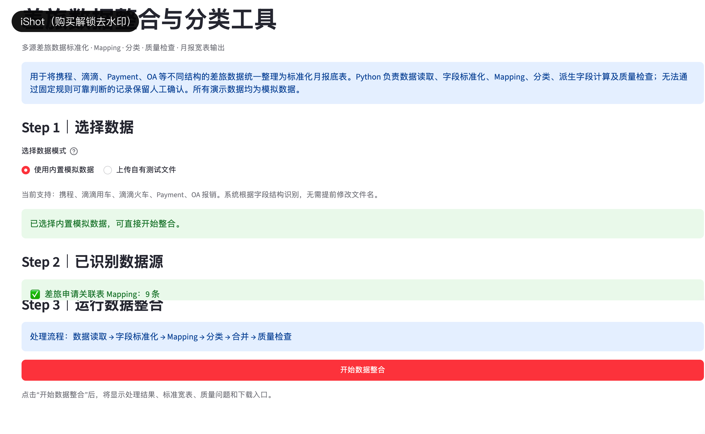
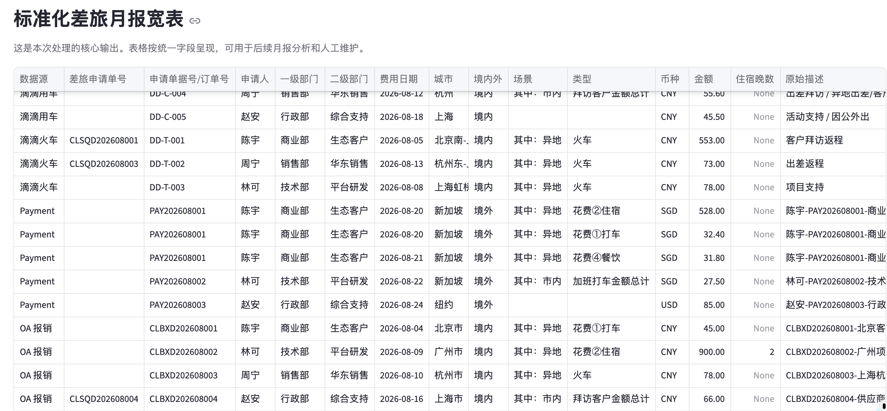
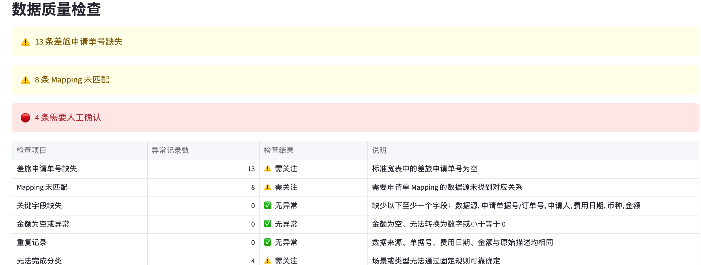

# 差旅数据整合与分类工具

## Travel Expense Analytics Assistant

将携程、滴滴、Payment、OA 等结构不同的差旅数据统一标准化、Mapping、分类并合并为可用于月报分析的标准宽表。

[🌐 在线 Demo（待补充）](#在线-demo) · [💻 GitHub Repository](https://github.com/Joyhanz-bot/travel-expense-analytics-assistant)



概览展示多源差旅文件识别、标准化处理、Mapping、分类和质量检查的完整 pipeline。

## 1. 项目简介

这是一个面向财务月报场景的多源差旅数据整合工具。它将不同平台的差旅明细读取、标准化、关联和分类，最终输出统一的标准化差旅月报宽表。

项目以 Python 确定性处理为核心，不把多源数据整理包装成 LLM 产品。固定规则无法可靠分类的记录会保留在待人工确认清单中，避免为了得到完整结果而强行判断。

## 2. 业务背景

差旅数据通常分散在携程、滴滴、Payment、OA 等系统中，字段名称、日期格式、金额口径和关联编号并不一致。若直接汇总，容易出现申请单无法匹配、重复记录、分类缺失和月报字段不统一等问题。

本项目的核心价值是：将多个结构不同的差旅数据源自动整理成统一、可用于月报分析的标准宽表。

## 3. 核心流程

```text
多源数据上传
        ↓
Source Parser 读取
        ↓
字段标准化
        ↓
差旅申请单 / 订单 Mapping
        ↓
金额、日期、城市、住宿晚数等派生字段计算
        ↓
固定规则分类
        ↓
多源合并与数据质量检查
        ↓
待人工确认
        ↓
标准化差旅月报宽表输出
```

## 4. 核心功能

- 支持携程、滴滴用车、滴滴火车、Payment、OA 报销等数据源。
- 识别来源并将不同字段统一到月报标准字段。
- 通过差旅申请单号、订单号等字段完成关联 Mapping。
- 计算费用日期、城市、境内外、住宿晚数等派生信息。
- 使用固定 Mapping 完成场景和类型分类。
- 汇总 Mapping 未匹配、关键字段缺失、金额异常、重复记录和无法分类数据。
- 输出可下载的标准化差旅月报宽表，以及待人工确认清单。

## 5. 关键业务逻辑

### 多源读取与字段标准化

`src/parsers.py` 根据当前已定义的数据源结构读取携程、滴滴用车、滴滴火车、Payment 和 OA 文件，并将日期、金额、申请单号、订单号等字段整理到统一口径。

### Mapping 与固定规则分类

Python 负责申请单 / 订单关联、申请单号提取、城市和境内外判断、住宿晚数计算，以及场景 / 类型固定 Mapping。当前分类方式在页面上展示为“固定规则”“固定 Mapping”或“待人工确认”，不把内部实现细节暴露给业务使用者。

### 数据质量检查

`src/quality_checker.py` 负责发现问题但不自动删除记录，主要检查：

- 差旅申请单号缺失或 Mapping 未匹配。
- 关键字段缺失。
- 金额为空或无法识别。
- 重复记录。
- 无法完成固定规则分类的记录。

当前内置模拟数据的基线结果为 5 个数据源、23 条原始记录、23 条成功整合、19 条固定规则完成分类、4 条待人工确认；实际上传文件时页面会根据数据动态计算。

## 6. Python / Semantic Analysis / Human Review 的职责边界

| 模块 | 负责内容 |
| --- | --- |
| Python 数据处理 | 多源读取、字段标准化、Mapping、派生字段、多表合并和质量检查 |
| 固定规则分类 | 场景、类型等可由字段和业务口径稳定判断的内容 |
| Human Review | 处理描述复杂、信息缺失或固定规则无法可靠分类的记录 |

当前公开版本默认不调用外部 LLM。对于固定规则无法稳定分类的非结构化描述，后续可以按需增加语义辅助分类，但不能替代质量检查和人工确认。

## 7. Demo 截图



标准化宽表是项目的核心输出：不同平台的记录最终进入同一套字段，可用于月度差旅费用分析和部门拆分。



质量检查区域会暴露 Mapping 未匹配、关键字段缺失和无法可靠分类的记录，不会为了追求完整率而静默删除或强行判断。

## 在线 Demo

> 当前未在仓库部署记录或 README 中发现可验证的 Streamlit 公网地址。请部署后将链接补充到顶部“在线 Demo”入口。

## 8. 项目结构

```text
travel-expense-analytics-assistant/
├── app.py                  # Streamlit 页面与处理流程
├── src/
│   ├── parsers.py          # 多源文件读取与标准化
│   ├── classifier.py       # Mapping、场景和类型分类
│   ├── quality_checker.py  # 数据质量检查
│   └── utils.py            # 通用辅助函数
├── sample_data/            # 模拟差旅数据和 Mapping 表
├── screenshots/            # 页面截图
├── requirements.txt
└── README.md
```

## 9. 如何运行

在项目根目录执行：

```bash
pip install -r requirements.txt
python3 -m streamlit run app.py
```

打开页面后，建议先选择“使用内置模拟数据”，点击“开始数据整合”，查看数据源概览、质量检查、待人工确认和标准化差旅月报宽表。

## 10. 模拟数据与隐私说明

所有公开数据均为模拟数据，不包含真实企业、员工、供应商、报销凭证或内部制度信息。`travel_mapping.xlsx`、差旅明细和模板文件均为演示用模拟数据。

## 11. 当前限制

- 当前仅支持代码中已定义的携程、滴滴用车、滴滴火车、Payment 和 OA 数据结构。
- 新增数据源需要补充对应 Parser 和字段标准化逻辑。
- Mapping 表覆盖范围和复杂文本分类能力有限，部分记录仍需要人工确认。
- 当前版本未连接真实财务系统、数据库或权限体系。
- 宽表可用于月报分析准备，但不等同于正式财务入账结果。

## 12. 后续扩展

- 增加更多差旅数据源和可配置字段 Mapping。
- 引入历史月份对比、部门趋势分析和 Dashboard。
- 对固定规则无法稳定分类的描述增加可选语义辅助能力。
- 对接真实报销、Payment 或财务系统，并补充数据血缘和审计日志。
